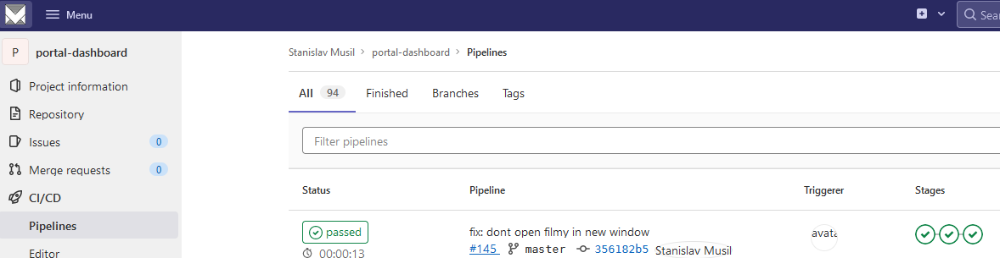

# 100DaysOfHomeLab
Twitter: #100DaysOfHomeLab

- [X] Day 001 - onprem Confluence upgrade to 7.18.1 [Critical security issue](https://confluence.atlassian.com/doc/confluence-security-advisory-2022-06-02-1130377146.html)

- [X] Day 002 - Updating server via ansible
- [X] Day 003 - creating VM and installing + configuring OS for [pi-hole](https://pi-hole.net/)
- [X] Day 004 - pi-HOLE installed

**Installation**

**admin web page**

- [X] Day 005 - Backing up wife's computer before re-installation, thanks to Veeam agent

- [X] Day 006 - My new additional storage server will be using BTRFS so time to learn something about it https://www.youtube.com/watch?v=RPO-fS6HQbY
- [x] Day 007 - Preparing new storage server - 8x8TB HDD + 6x1.6TB Enterprise SSD. 64GB RAM, 2x 10Gbit NI
- [X] Day 008 - Maintenance on old storage server. Added 18TB disk to old storage server. Just to do backup of backups before migration to new storage :) And of course I have another copy in the Cloud (S3 immutable storage). 
- [X] Day 009 - I resuscitated physical server at the disaster recovery location. high temperature... faulty air-condition. 
- [X] Day 010 - home notebook upgrade - 512GB NVMe for #VMware Workstation VM's and +32GB RAM (64GB Total)
- [X] Day 011 - I spent great day  with @vmugcz members discussing not only
- [X] Day 012 - Preparing installation USB (@Windows  11, @ubuntu  22.04, @CentOS  8Stream) for #homelab new physical clients. 
- [X] Day 013 - Bring back grafana back to game

- [X] Day 014 - Uptime Kuma implemented

- [X] Day 015 - AWX installed and configured

- [X] Day 016 - Adding more and more servers to the Check MK monitoring

- [X] Day 017 - Upgraded S3 MINIO server in homelab [bug fix](https://github.com/minio/minio/releases/tag/RELEASE.2022-06-25T15-50-16Z)

- [X] Day 018 - Integrate runner with CI/CD into #homelab GitLab 
 

 

- [X] Day 019 - Repairing son’s notebook. There was a bad CMOS battery. More than 25 screws.

- [X] Day 020 - Patching and updating firmware, BIOS on my notebook. And also playing with #Terraform 

- [X] Day 021 - RaspberryPi based Meteostation back in game (temperature, Wind speed, Wind direction) 
  

- [X] Day 022 - Added temporary server to #homelab to migrate data  to new storage server with less impact. As I want to reuse some disks/controllers/10gig NICs. 
- [X] Day 023 - (5.7.2022) - I Installed ESXi OS 7.0u3 onto new temporary server and configured networking. Also I configured passthrough PCIe storage controller into VM.
  

- [X] Day 024 - Transcoding my video files to save space on storage by using Tdarr  - https://tdarr.io/

- [X] Day 025 - Moving data to temp. storage (18TB drive) to free up old storage HW. Once done reuse some "old" HW in new storage. #100DaysOfHomeLab

[comment]: <> (dovezt NUC1)

- [X] Day 026 - Unboxing my new camera Logitech Brio, USB-C hub and solar powerbank VIKING W24W. Looking forward to test it :)

- [X] Day 027 - Helping friend with networking
  

- [X] Day 028 - Added 2x NVMe into ESXi's hosts (Samsung_SSD_970_EVO_500GB).

- [X] Day 029 - Playing with "Platform 9" = Managed Kubernetes plane. Free plan offers management capabilities up to 3 clusters & 20 nodes. Note: you must provide cluster infrastructure by yourself. https://platform9.com/

- [X] Day 030 - Patching Tuesday :) so glad that I invest the time to some @ansible  automation. The number of servers in #homelab increasing so fast. Time to start thinking about #K8S as the main tool for #homelab services.
- [X] Day 031 - Time for #vCenter upadte 7.0.3f in #homelab https://docs.vmware.com/en/VMware-vSphere/7.0/rn/vsphere-vcenter-server-70u3f-release-notes.html
<!-- 13.7.2022 -->

- [X] Day 032 - IPAM @phpipam upgraded to 1.5.0 

- [X] Day 033 - Observium https://www.observium.org/

- [X] Day 034 - Build PXE server for booting over the network. For now with just one OS, but more to come :)

- [X] Day 035 - Extending PXE boot menu..   CentOS 8 and 9 Stream, Ubuntu 18.04, 22.04 LTS and VMware ESXi 7.x
<!-- 17.7.2022-->

- [X] Day 036 - Maintenance on wife's computer. She is running out of space again :) As usual clean "Download" folder and move photos to shared drive :)

- [X] Day 037 - Attend @MyVMUG Workshop - #Tanzu Community Edition Training #1 @VMwareTCE  with Jeff Butler. Here is his repo: https://github.com/jeffgbutler/TCEWorkshop

- [X] Day 038 - Upgrading PiHole - it's soo simple.. just run "sudo pihole -up"

- [X] Day 039 - Emby @embyapp  server upgraded to the latest version and purchased Premiere lifetime license.
  <!--21.7.2022 -->
  

- [X] Day 040 - Testing my son's new keyboard :) "CZC.Gaming Guardian, Kailh Red" with red linear switches.  Looks really good and he likes  it, but I prefer brown switches. :) What is your favourite keayboard with which switches?

 

- [X] Day 041 - vCenter upgrade 7.0.3g Release notes: https://docs.vmware.com/en/VMware-vSphere/7.0/rn/vsphere-vcenter-server-70u3g-release-notes.html

 

- [X] Day 042 - Build my own "Speedtest" web server with LibreSpeed https://github.com/librespeed/speedtest

- [X] Day 043 - Configured <a href="https://github.com/NginxProxyManager/nginx-proxy-manager" target="_blank">Nginx proxy manager</a> to publish local services to the internet with Let's encrypt certificates 

- [X] Day 044 - Added 2nd (bakcup) VPN (L2TP server) connection to #homelab over old WIFI internet connection.
- [X] Day 045 - Playing with containers - wordpress (web+mysql)

- [X] Day 046 - Continue playing with containers.. this time with @portainerio

 

- [X] Day 047 - Labeling time...Labels are ready.. (happy sysadmin day)
<!-- 29.7.2022 -->

- [X] Day 048 - Upgrading all my mikrotik routers/AP from version 6.x to 7.4

- [X] Day 049 - Playing with "Shields IO" https://shields.io/

- [X] Day 050 - WSL upgrade to Ubuntu 22.04 TLS

- [X] Day 051 - Visual Code in web browser - https://github.com/coder/code-server

- [X] Day 052 - Preparing #homelab for NSX-T 4.0 upgrade https://docs.vmware.com/en/VMware-NSX/4.0/rn/vmware-nsx-4001-release-notes/index.html

- [X] Day 053 - GitLab update ASAP from 15.1 to 15.2.2-ee.0.el8

- [X] Day 054 & 055- Created #terraform script to deploy @Azure AKS cluster - source code: https://github.com/musil/azure-k8s-small-001 Before you apply you can see costs with @infracost 

- [X] Day 056 - Working on moving terraform state file of my #homlab AKS cluster from local storage to Azure Storage Account

- [X] Day 057 - Updated Kerio Connect (Mail) server to latest version 9.4.1 patch1
<!--8.8.2022 -->

- [X] Day 058 - I just yesterday updated Kerio Connect (mail) server to the version 9.4.1 patch1 and today was released new version 9.4.2 :)

<!-- patching windows & Linux -->

- [X] Day 059 - Added more vCPU to GitLab server and upgraded GitLab runner Ubuntu 20.04.

- [ ] Day 060 - 
- [ ] Day 061 - 
- [ ] 
<!--

Postuj i na 
- linkedIn
- Facebook
- Twitter
- Instagram
- VPXD blog
[comment]: <> (clean up VM's to save space)
[comment]: <> (Nearstore2)
patching servers tuesday after 30days 12.6,12.7,9.8,6.9
patching notebooks
Windows 11

- Logging - syslog (grafana/loki nebo LogInsight)
- link shortennig "shlink"
- Harbor registry
- K8S cluster in HA
	- rancher
	- portainer.io
	- traefik
	- argoCD
- seafile ?
- tautulli
- syncthing ?
- nextcloud
- unify-video
- NTP
- LOADBALANCER
- Firewall HA
- Router HA

https://nip.io/
https://kind.sigs.k8s.io/
https://free-for.dev/

-->

- [ ] Day 062 - 
- [ ] Day 063 - 
- [ ] Day 064 - 
- [ ] Day 065 - 
- [ ] Day 066 - 
- [ ] Day 067 - 
- [ ] Day 068 - 
- [ ] Day 069 - 
- [ ] Day 070 - 
- [ ] Day 071 - 
- [ ] Day 072 - 
- [ ] Day 073 - 
- [ ] Day 074 - 
- [ ] Day 075 - 
- [ ] Day 076 - 
- [ ] Day 077 - 
- [ ] Day 078 - 
- [ ] Day 079 - 
- [ ] Day 080 - 
- [ ] Day 081 - 
- [ ] Day 082 - 
- [ ] Day 083 - 
- [ ] Day 084 - 
- [ ] Day 085 - 
- [ ] Day 086 - 
- [ ] Day 087 - 
- [ ] Day 088 - 
- [ ] Day 089 - 
- [ ] Day 090 - 
- [ ] Day 091 - 
- [ ] Day 092 - 
- [ ] Day 093 - 
- [ ] Day 094 - 
- [ ] Day 095 - 
- [ ] Day 096 - 
- [ ] Day 097 - 
- [ ] Day 098 - 
- [ ] Day 099 - 
- [ ] Day 100 - 
